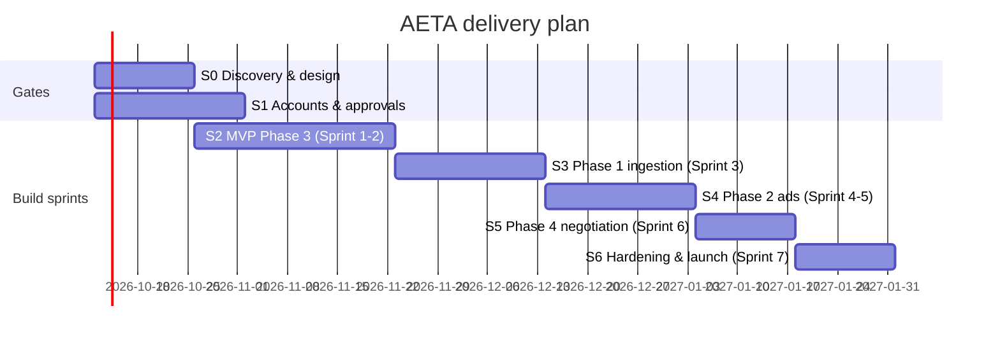

# AETA — Project Plan, Stack & Cost Breakdown

Companion to [BLUEPRINT.md](./BLUEPRINT.md). Covers delivery approach, step-by-step work breakdown with cost, the full tech stack with pricing, and the monthly running cost broken down per component and per lead.

> Estimates as of Oct 2026, $1 ≈ ₹88. Vendor prices marked *(est.)* should be re-confirmed with the vendor before quoting. Claude API prices are list prices.

---

## 1. Delivery approach: Stage-gated Agile (not pure Waterfall)

Pure Waterfall fails here for two reasons:

1. **Voice quality cannot be specified up front** — Hinglish recognition, latency and objection handling only get good by iterating on real call recordings.
2. **External approvals (Meta app review, WhatsApp templates, 140/160 series numbers) have unpredictable lead times** — a strict sequence would leave the team idle.

So the plan uses a **hybrid**:

| Layer | Method | Why |
|---|---|---|
| Discovery, compliance, approvals | **Waterfall-style stage gates** — each needs written sign-off before the next stage | Fixed scope, external dependencies, legal sign-off |
| Build | **2-week Agile sprints**, each delivering a working vertical slice | Fast feedback, demo every 2 weeks |
| Ordering | **MVP-first by business value**: Phase 3 (lead → call) ships first, then 1, 2, 4 | Phase 3 makes money with the client's existing listings and proves conversion before investing in automation around it |
| Quality | **Exit gate per stage**: UAT with real data before moving on | Stops defects from compounding |

### Timeline (16 weeks)

| Week | Stage | Exit gate (must pass to proceed) |
|---|---|---|
| 1–2 | S0 Discovery & design | Signed spec, call scripts, pricing rules, data model |
| 1–3 | S1 Accounts & approvals (parallel) | Meta app approved, WABA + templates live, calling numbers allotted |
| 3–6 | S2 MVP — Phase 3 | 50 live leads called; <1 s turn latency; ≥80% correct qualification on review |
| 7–9 | S3 Phase 1 — supplier ingestion | 30 real brochures extracted, ≥95% field accuracy after review |
| 10–12 | S4 Phase 2 — creatives & ads | First auto-published campaign live with approved creatives |
| 13–14 | S5 Phase 4 — negotiation & closing | Negotiation engine passes scripted adversarial calls; payment link E2E |
| 15–16 | S6 Hardening & launch | Load test at 50 concurrent calls, pentest findings closed, go-live |

---

## 2. Step-by-step work breakdown & build cost

**Day rates used (Indian contract market):** Tech lead / AI engineer ₹12,000 · Backend/voice dev ₹7,000 · Frontend dev ₹6,000 · QA/DevOps ₹6,000.

#### S0 — Discovery & design

| # | Step | Lead | Backend | Frontend | QA/DevOps | Person-days | Cost |
|---|---|---|---|---|---|---|---|
| 0.1 | Requirement workshops: cities, pricing rules, call scripts, KPIs | 4 |  |  |  | 4 | ₹48,000 |
| 0.2 | Architecture, data model, API contracts | 4 | 2 |  |  | 6 | ₹62,000 |
| 0.3 | Conversation design: Hindi/English/Hinglish scripts, objection bank | 2 | 2 |  |  | 4 | ₹38,000 |
| 0.4 | Dashboard wireframes |  |  | 4 |  | 4 | ₹24,000 |
| 0.5 | Consent text, privacy policy inputs, compliance checklist | 1 |  |  |  | 1 | ₹12,000 |
| 0.6 | Cloud accounts, CI/CD, staging/prod, IaC |  |  |  | 4 | 4 | ₹24,000 |
| | **Stage total** | | | | | **23** | **₹2,08,000** |

#### S1 — Accounts & approvals (parallel)

| # | Step | Lead | Backend | Frontend | QA/DevOps | Person-days | Cost |
|---|---|---|---|---|---|---|---|
| 1.1 | Meta Business verification + app review | 2 |  |  |  | 2 | ₹24,000 |
| 1.2 | WhatsApp Business account + template approval |  | 1 |  |  | 1 | ₹7,000 |
| 1.3 | Telephony account, KYC, 140/160 series numbers |  | 1 |  |  | 1 | ₹7,000 |
| | **Stage total** | | | | | **4** | **₹38,000** |

#### S2 — MVP: lead -> AI call -> visit (Phase 3)

| # | Step | Lead | Backend | Frontend | QA/DevOps | Person-days | Cost |
|---|---|---|---|---|---|---|---|
| 2.1 | Meta leadgen webhook, HMAC verify, dedupe, lead store |  | 4 |  |  | 4 | ₹28,000 |
| 2.2 | Lead form with consent checkbox | 1 |  |  |  | 1 | ₹12,000 |
| 2.3 | Dialer: queue, retry ladder, DND/consent check, spend caps |  | 5 |  |  | 5 | ₹35,000 |
| 2.4 | Voice pipeline + STT/TTS benchmarking on Hinglish | 8 | 4 |  |  | 12 | ₹1,24,000 |
| 2.5 | Agent tools: property facts, search, update lead, book visit | 3 | 3 |  |  | 6 | ₹57,000 |
| 2.6 | Post-call summary, BANT extraction, lead scoring | 2 |  |  |  | 2 | ₹24,000 |
| 2.7 | Calendar booking + WhatsApp reminders |  | 3 |  |  | 3 | ₹21,000 |
| 2.8 | Dashboard v1: leads, calls, recordings, transcripts |  |  | 10 |  | 10 | ₹60,000 |
| 2.9 | QA: 200+ test calls, latency tests, UAT with 50 live leads |  |  |  | 5 | 5 | ₹30,000 |
| | **Stage total** | | | | | **48** | **₹3,91,000** |

#### S3 — Supplier ingestion (Phase 1)

| # | Step | Lead | Backend | Frontend | QA/DevOps | Person-days | Cost |
|---|---|---|---|---|---|---|---|
| 3.1 | WhatsApp inbound webhook, media download, S3 |  | 3 |  |  | 3 | ₹21,000 |
| 3.2 | Extraction pipeline (PDF/image/link) + schema validation | 6 | 2 |  |  | 8 | ₹86,000 |
| 3.3 | Missing-field follow-up scheduler with templates |  | 2 |  |  | 2 | ₹14,000 |
| 3.4 | Outbound supplier voice call (optional) |  | 3 |  |  | 3 | ₹21,000 |
| 3.5 | Review/approval UI with source-page viewer |  |  | 8 |  | 8 | ₹48,000 |
| 3.6 | Embeddings + property search index | 2 |  |  |  | 2 | ₹24,000 |
| 3.7 | QA on 30 real brochures |  |  |  | 3 | 3 | ₹18,000 |
| | **Stage total** | | | | | **29** | **₹2,32,000** |

#### S4 — Creatives & Meta ads (Phase 2)

| # | Step | Lead | Backend | Frontend | QA/DevOps | Person-days | Cost |
|---|---|---|---|---|---|---|---|
| 4.1 | Ad copy generator + numeric fact-checker | 4 |  |  |  | 4 | ₹48,000 |
| 4.2 | Creative templating engine (1:1, 4:5, 9:16) |  | 5 | 3 |  | 8 | ₹53,000 |
| 4.3 | Meta Marketing API: campaign/ad set/ad/lead form |  | 6 |  |  | 6 | ₹42,000 |
| 4.4 | Creative approval UI + previews |  |  | 6 |  | 6 | ₹36,000 |
| 4.5 | Insights sync + auto-pause / new-variant loop | 2 | 3 |  |  | 5 | ₹45,000 |
| 4.6 | QA |  |  |  | 3 | 3 | ₹18,000 |
| | **Stage total** | | | | | **32** | **₹2,42,000** |

#### S5 — Negotiation & closing (Phase 4)

| # | Step | Lead | Backend | Frontend | QA/DevOps | Person-days | Cost |
|---|---|---|---|---|---|---|---|
| 5.1 | Pricing config + evaluate_offer engine + audit log | 4 | 2 |  |  | 6 | ₹62,000 |
| 5.2 | Razorpay payment links + webhook |  | 3 |  |  | 3 | ₹21,000 |
| 5.3 | Deal brief PDF + warm transfer to human | 2 | 3 |  |  | 5 | ₹45,000 |
| 5.4 | Pricing rules & negotiation log UI |  |  | 5 |  | 5 | ₹30,000 |
| 5.5 | QA |  |  |  | 3 | 3 | ₹18,000 |
| | **Stage total** | | | | | **22** | **₹1,76,000** |

#### S6 — Hardening & launch

| # | Step | Lead | Backend | Frontend | QA/DevOps | Person-days | Cost |
|---|---|---|---|---|---|---|---|
| 6.1 | Security review / in-house pentest | 3 |  |  |  | 3 | ₹36,000 |
| 6.2 | Load test (50 concurrent calls) |  | 2 |  | 3 | 5 | ₹32,000 |
| 6.3 | Monitoring, alerting, runbooks |  |  |  | 4 | 4 | ₹24,000 |
| 6.4 | Voice tuning on real transcripts | 4 |  |  |  | 4 | ₹48,000 |
| 6.5 | Go-live + 1 week hypercare | 2 | 2 | 1 | 2 | 7 | ₹56,000 |
| | **Stage total** | | | | | **23** | **₹1,96,000** |

### Build cost summary

| Stage | Weeks | Person-days | Labour cost |
|---|---|---|---|
| S0 Discovery & design | 1–2 | 23 | ₹2,08,000 |
| S1 Accounts & approvals | 1–3 | 4 | ₹38,000 |
| S2 MVP — Phase 3 | 3–6 | 48 | ₹3,91,000 |
| S3 Phase 1 — ingestion | 7–9 | 29 | ₹2,32,000 |
| S4 Phase 2 — ads | 10–12 | 32 | ₹2,42,000 |
| S5 Phase 4 — negotiation | 13–14 | 22 | ₹1,76,000 |
| S6 Hardening & launch | 15–16 | 23 | ₹1,96,000 |
| **Direct engineering** | | **181** | **₹14,83,000** |
| PM, code review, meetings, bug-fix buffer (30%) | | ~54 | ₹4,44,900 |
| **Labour total** | | **~235** | **₹19,27,900** |

| One-time non-labour item | Low | High |
|---|---|---|
| Dev/staging infra, API credits, test calls & voice evals | ₹75,000 | ₹1,50,000 |
| WhatsApp BSP onboarding / template setup | ₹0 | ₹25,000 |
| Telephony setup (140/160 series, KYC, deposits) | ₹10,000 | ₹50,000 |
| RERA agent registration (company, per state) | ₹25,000 | ₹1,00,000 |
| Legal: privacy policy, consent text, DPDP review | ₹50,000 | ₹1,50,000 |
| External pentest (₹0 if done in-house) | ₹0 | ₹1,50,000 |
| **Non-labour subtotal** | **₹1,60,000** | **₹6,25,000** |

| | Low | High |
|---|---|---|
| Labour | ₹19,27,900 | ₹19,27,900 |
| Non-labour | ₹1,60,000 | ₹6,25,000 |
| Contingency (~10%) | ₹2,00,000 | ₹2,50,000 |
| **Total build cost** | **≈ ₹22.9 lakh** (~$26k) | **≈ ₹28 lakh** (~$32k) |

**Team:** 1 tech lead / AI engineer, 1 backend/voice developer, 1 frontend developer, 1 QA/DevOps (part-time). Total 16 weeks.

**Cheaper variant (lean, ≈ ₹8–12 lakh, 10–12 weeks):** 2 developers, managed voice platform (Bolna/Vapi), WhatsApp BSP dashboard instead of custom UI, n8n for glue, Phase 2 creatives semi-manual (Canva templates).

---

## 3. Tech stack with costs

### 3.1 Stack by layer

| Layer | Recommended | Alternative | Pricing model | Fixed / month | Variable |
|---|---|---|---|---|---|
| Backend API | Python + FastAPI | Node + NestJS | Open source | ₹0 | — |
| Workers / queue | Celery + Redis | BullMQ | Open source + managed Redis | ₹2,500 (ElastiCache small) | — |
| Database | PostgreSQL 16 + pgvector (AWS RDS) | Supabase | Instance | ₹3,000–20,000 | — |
| Object storage | AWS S3 (Mumbai) + CloudFront | Cloudflare R2 | Per GB | ₹500–3,000 | ~₹2/GB-month |
| Compute | AWS ECS Fargate (ap-south-1) | EC2 / GCP Cloud Run | Per vCPU-hour | ₹5,000–40,000 | — |
| Dashboard | Next.js | React + Vite | Vercel Pro / self-host | ₹0–2,000 | — |
| LLM — extraction, copy, summaries | Claude Sonnet 5.5 | Claude Opus 5.5 for hardest docs | $2 / $10 per MTok in/out, cache reads $0.20 | — | see 3.3 |
| LLM — live call turns, routing | Claude Haiku 4.5 | Claude Sonnet 5.5 | $1 / $5 per MTok in/out | — | ~₹0.6 / call-min |
| Embeddings | Voyage / open-source (bge-m3) self-hosted | OpenAI embeddings | Per token | ₹0–1,000 | negligible |
| WhatsApp | Meta Cloud API (direct) | Interakt / AiSensy / Gupshup | Per message (+BSP plan) | ₹0 (direct) / ₹2,500–4,000 (BSP) | ₹0.12–0.90 / msg |
| Telephony | Exotel *(est.)* | Plivo, Ozonetel | Number rental + per minute | ₹2,000–5,000 | ₹0.6–1.0 / min |
| Voice orchestration | Pipecat (self-hosted) | Bolna, Vapi, Retell (managed) | Compute / per-min platform fee | ₹0 | ₹0.2 self-host · ₹2–4.5 managed |
| Speech-to-text | Sarvam Saarika *(est.)* | Deepgram Nova-3 | Per audio minute | — | ₹0.5–0.7 / min |
| Text-to-speech | Sarvam Bulbul *(est.)* | ElevenLabs Flash, Cartesia | Per character | — | ₹0.5–0.8 / min (Sarvam) · ₹2–4 (ElevenLabs) |
| Ad platform | Meta Marketing API + Lead Ads | — | Free API; ad spend separate | ₹0 | client ad budget |
| Creative rendering | Pillow/Sharp templates (self-built) | Bannerbear / Templated | SaaS plan | ₹0 / ₹4,000–8,000 | — |
| Calendar | Google Calendar API | Cal.com | Free | ₹0 | — |
| Payments | Razorpay payment links | Cashfree | % per transaction | ₹0 | ~2% of token amount |
| PDF generation | WeasyPrint | Puppeteer | Open source | ₹0 | — |
| Observability | Sentry + Grafana Cloud + Langfuse | Datadog | SaaS tiers | ₹3,000–8,000 | — |
| CI/CD, IaC | GitHub Actions + Terraform | GitLab CI | Free tier / minutes | ₹0–2,000 | — |
| Secrets | AWS Secrets Manager | Doppler | Per secret | ₹500 | — |

### 3.2 AI voice cost per call-minute

| Component | Self-hosted (Pipecat + Sarvam + Haiku) | Managed (Bolna-style) | Premium managed (Vapi + ElevenLabs) |
|---|---|---|---|
| Telephony (Exotel) | ₹0.8 | ₹0.8 | ₹0.8 |
| Speech-to-text | ₹0.5 | ₹0.5 | ₹0.7 |
| LLM (Claude Haiku 4.5, cached prompt) | ₹0.6 | ₹0.6 | ₹0.6 |
| Text-to-speech | ₹0.6 | ₹0.8 | ₹3.0 |
| Orchestration / platform fee | ₹0.2 (compute) | ₹2.3 | ₹4.4 |
| **Total per minute** | **≈ ₹2.7** | **≈ ₹5.0** | **≈ ₹9.5** |

LLM per-minute math: ~6 agent turns/min × ~3,000 input tokens (≈80% served from prompt cache) + ~60 output tokens per turn → ≈ $0.007/min ≈ ₹0.6.

Recommendation: **start on managed (₹5/min) for the MVP**, switch to self-hosted after ~3,000 leads/month when the ₹2.3/min saving pays for the engineering.

### 3.3 LLM cost per task (Claude list prices)

| Task | Model | Tokens (in / out) | Cost per unit |
|---|---|---|---|
| Brochure extraction (≈30-page PDF with images) | Sonnet 5.5 | ~45k / 3k | ≈ $0.12 ≈ ₹11 per property (₹6 via Batch API, 50% off) |
| Follow-up message drafting | Haiku 4.5 | ~2k / 300 | ≈ ₹0.3 |
| Ad copy set (15 variants) + fact-check | Sonnet 5.5 | ~6k / 3k | ≈ ₹4 per property |
| Live call (4 min) | Haiku 4.5 | see 3.2 | ≈ ₹2.4 per call |
| Post-call summary + scoring | Sonnet 5.5 | ~4k / 600 | ≈ ₹1.2 per call |
| Deal brief | Sonnet 5.5 | ~10k / 2k | ≈ ₹3.5 per deal |

---

## 4. Monthly running cost — detailed breakdown

Assumptions per lead: 1.8 dial attempts, 60% connect, ~4 min qualification call, 15% get a ~5 min follow-up/negotiation call → **≈ 3.4 billable minutes per lead**. Voice priced at the managed rate (₹5/min).

### 4.1 By component

| Component | Small (1,000 leads) | Medium (5,000 leads) | Large (20,000 leads) |
|---|---|---|---|
| **Voice** — telephony | ₹2,700 | ₹13,600 | ₹54,400 |
| **Voice** — STT | ₹1,700 | ₹8,500 | ₹34,000 |
| **Voice** — LLM turns | ₹2,000 | ₹10,200 | ₹40,800 |
| **Voice** — TTS | ₹2,700 | ₹13,600 | ₹54,400 |
| **Voice** — platform fee | ₹7,900 | ₹39,100 | ₹1,56,400 |
| *Voice subtotal* | *₹17,000* | *₹85,000* | *₹3,40,000* |
| **WhatsApp** — lead reminders/nurture | ₹4,000 | ₹16,000 | ₹64,000 |
| **WhatsApp** — supplier follow-ups | ₹1,000 | ₹4,000 | ₹16,000 |
| *WhatsApp subtotal* | *₹5,000* | *₹20,000* | *₹80,000* |
| **LLM** — extraction + ad copy | ₹2,000 | ₹5,000 | ₹15,000 |
| **LLM** — post-call summaries, briefs | ₹3,000 | ₹10,000 | ₹35,000 |
| *LLM subtotal* | *₹5,000* | *₹15,000* | *₹50,000* |
| **Cloud** — compute (API, workers) | ₹5,000 | ₹15,000 | ₹40,000 |
| **Cloud** — Postgres (RDS) | ₹3,000 | ₹7,000 | ₹20,000 |
| **Cloud** — Redis, S3, CDN, backups, data transfer | ₹4,000 | ₹8,000 | ₹20,000 |
| *Cloud subtotal* | *₹12,000* | *₹30,000* | *₹80,000* |
| **SaaS** — telephony rental, BSP plan | ₹4,000 | ₹6,000 | ₹10,000 |
| **SaaS** — observability (Sentry, Grafana, Langfuse) | ₹3,000 | ₹6,000 | ₹15,000 |
| **SaaS** — creative engine, hosting, domain, secrets | ₹3,000 | ₹8,000 | ₹15,000 |
| *SaaS subtotal* | *₹10,000* | *₹20,000* | *₹40,000* |
| **People** — maintenance / on-call dev | ₹60,000 | ₹1,00,000 | ₹2,00,000 |
| **Total / month (ex-ads)** | **₹1,09,000** | **₹2,70,000** | **₹7,90,000** |
| Meta ad spend @ ~₹400 CPL (client budget) | ₹4,00,000 | ₹20,00,000 | ₹80,00,000 |
| **Grand total incl. ads** | **₹5,09,000** | **₹22,70,000** | **₹87,90,000** |

### 4.2 Cost per lead — waterfall (medium scenario, 5,000 leads/month)

How one lead's cost builds up, step by step through the pipeline:

| Step in pipeline | Adds | Running total |
|---|---|---|
| 1. Meta ad click → form submit (CPL) | ₹400.0 | ₹400.0 |
| 2. Webhook ingest, dedupe, DND check | ₹0.1 | ₹400.1 |
| 3. AI qualification call (~3.4 billable min incl. retries) | ₹17.0 | ₹417.1 |
| 4. Post-call summary + scoring | ₹1.2 | ₹418.3 |
| 5. WhatsApp reminders / nurture | ₹4.0 | ₹422.3 |
| 6. Share of supplier ingestion + ad creative LLM | ₹1.8 | ₹424.1 |
| 7. Share of cloud + SaaS | ₹10.0 | ₹434.1 |
| 8. Share of maintenance staff | ₹20.0 | **₹454.1** |

**AI system cost ≈ ₹54 per lead (≈12% of total); ad spend ≈ 88%.** Optimising CPL and lead-to-visit conversion matters far more than shaving AI costs.

### 4.3 Cost per outcome (medium scenario, illustrative funnel)

| Funnel stage | Rate | Count / month | Cost per outcome (incl. ads) |
|---|---|---|---|
| Leads | — | 5,000 | ₹454 |
| Connected & qualified | 30% | 1,500 | ₹1,513 |
| Site visits booked | 25% of qualified | 375 | ₹6,053 |
| Bookings / token paid | 8% of visits | 30 | ₹75,667 |

On a ₹1 crore unit at 2% commission (₹2 lakh), a single booking covers ~2.6× its acquisition cost. Funnel rates are illustrative — replace with client data after the MVP.

### 4.4 Savings levers

| Lever | Saving | When |
|---|---|---|
| Self-hosted voice (Pipecat + Sarvam) instead of managed | ~45% of voice cost (₹5 → ₹2.7/min) | > 3,000 leads/month |
| Prompt caching on system prompt + property facts | ~60–80% of LLM input cost | From day 1 |
| Batch API for brochure extraction (non-urgent) | 50% of extraction cost | From day 1 |
| Utility templates and free 24h-window replies instead of marketing templates | ~70% of WhatsApp cost | Where policy allows |
| Opus-codec recordings + 90-day retention | Keeps storage flat | From day 1 |
| Drop retries after 3 unanswered attempts | ~10% of voice minutes | From day 1 |
